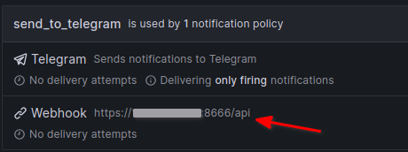

Requires working [poste_prometheus_exporter](https://github.com/dtkbrbq/poste_prometheus_exporter) with configured alerting in grafana.

Little API for automatical password changing of mailbox on [Poste.io](https://poste.io/) mailserver. \
Works with grafana, receives alert and makes changes in corresponding mailbox. \
You have to configure grafana alerting(contact points - webhook) for this to work. \
 \
 \
Running in Portainer require ENV variables must be specified without quotes.
